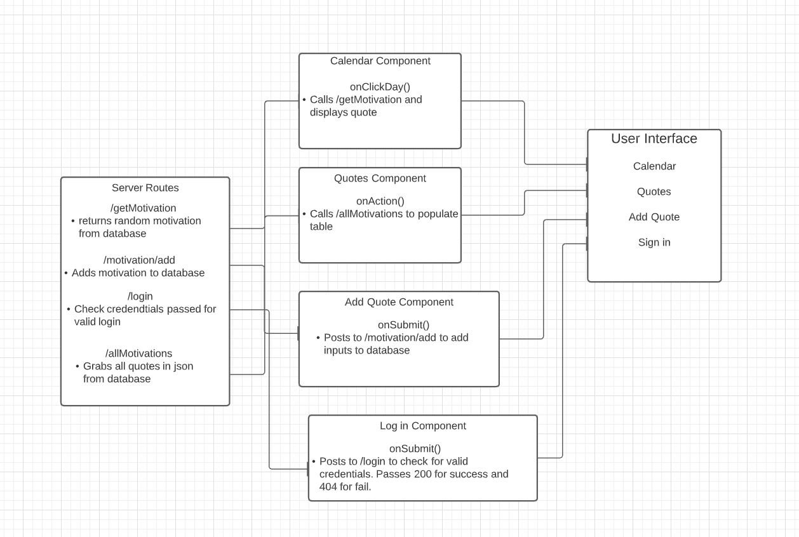
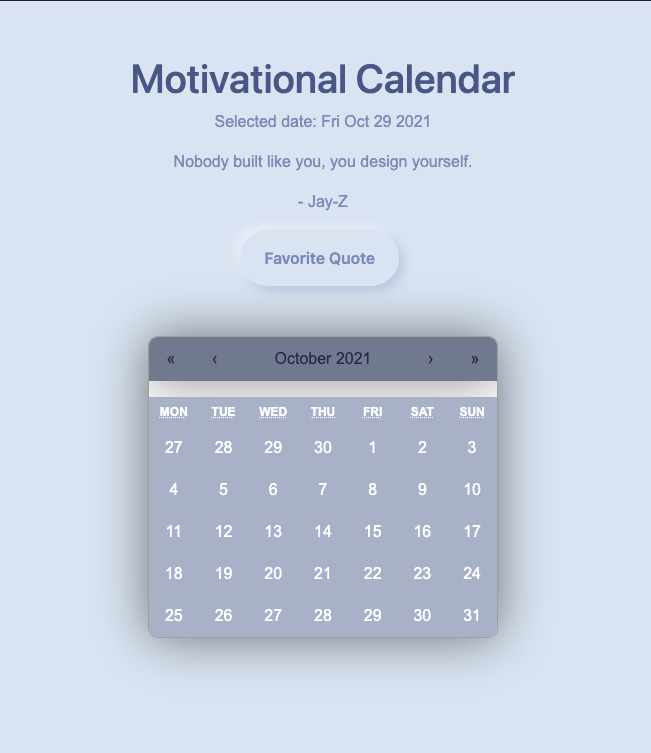

# Motivational Calendar 

## Overview
For this project, we created a calendar which displays a quote for each day selected. The user is able to view, favorite, and add additional quotes to the database if they choose. 

We used React to build out our front-end components along with Bootstrap and CSS to style. For our backend we focused on using Javascript, Sqlite, Sequelize, and Express to build a database and server.

>#### Current Project Status: 
>Currently, our team is focusing on integrating a sign-in feature where a user can tailor the calendar to their liking. 

## Project Details: 
### UML Diagram
A breakdown of our thought process in planing and connecting the different components of the webapp together.

### MVP
The MVP of this project is the motivational calendar. This is an interactive calendar that allows the user the click a dat and recieve a random motivational quote. The user can favorite the quote which will save it to their user. 

##  Technologies

> - Javascript 
> - Bootstrap - v. 5.1.3
> - Bootswatch - v. 5.1.3
> - Cors - v. 2.8.5
> - Express - v. 4.17.1
> - Morgan - v. 1.10.0
> - Nodemon - v. 2.0.14
> - React - v. 17.0.2
> - React-Bootstrap - v. 2.0.0
> - React-calendar - v. 3.5.0
> - React-dom - v. 17.0.2
> - React-Router-Dom - v. 5.3.0
> - Sequelize - v. 6.8.0
> - Sqlite3 - v. 5.0.2
> - Parcel-bundler - v. 1.12.5

## Set Up: 
To run this locally, install it using npm: 
   `$ cd ../project_name 
    $ npm install 
    $npm install cors express morgan nodemon react-calendar react-router-dom sequelize sqlite3 react 
    $npm install --save-dev parcel-bundler 
    You will need two terminals open to start the back end and the front end: 
    $npm run start (to start the server) 
    $npm run start-dev (to start the front end)`

### Meet the Team: 
- [Ayden Scott](https://github.com/Boymeetsworld "Ayden's GitHub Profile"): Current Multiverse Apprentice working at McKinsey.
- [Rasheika Fulton](https://github.com/ZaraSky2207 "Rasheika's GitHub Profile"): Current Multiverse Apprentice working at McKinsey.
- [AleDavaMart](https://github.com/AleDavMart "Aleyda's GitHub Profile"): Current Mutliverse Apprentice working at Adyen.
- [Ian Kinney](https://github.com/ianmkinney "Ian's GitHub Profile"):  Is the project lead and a current Multiverse Apprentice working with McKinsey. 